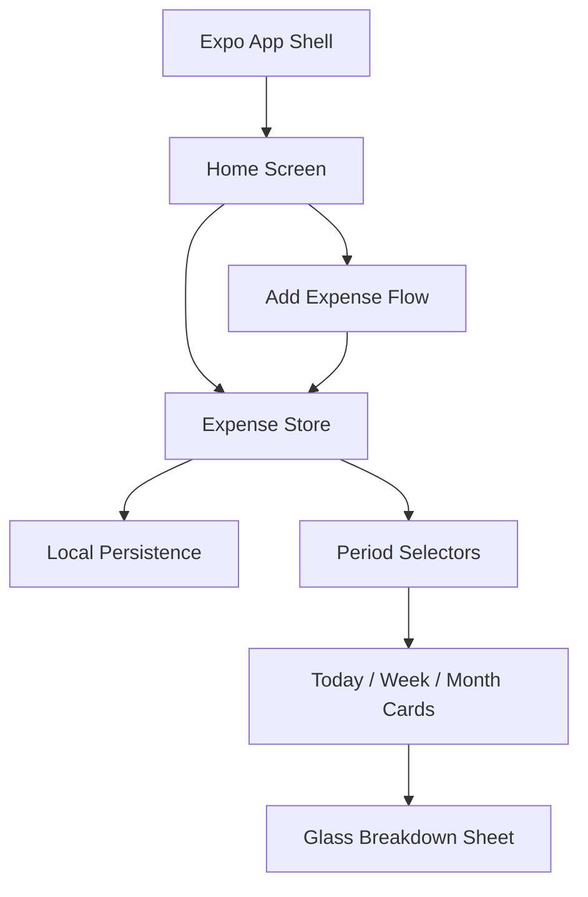

# feat: Build finance tracker MVP

## Summary

Build a greenfield Expo React Native TypeScript app for iOS-first manual expense tracking. The MVP centers on quick expense entry, Today / Week / Month spending totals, and an iOS glass-style bottom sheet showing the transaction breakdown for a selected period.

---

## Problem Frame

The user wants a simple financial tracker rather than a full personal finance suite. The first version should make manual expense capture fast and make the home screen feel immediately useful by turning those entries into period summaries and breakdowns.

---

## Requirements

**App Foundation**

- R1. The app runs as an Expo React Native TypeScript project suitable for native iOS development.
- R2. The app persists manually entered expenses locally so totals survive app restarts.
- R3. The MVP remains local-only with no login, bank import, account sync, income tracking, budgets, or backend service.

**Expense Capture**

- R4. The user can add an expense with amount, merchant or note, category, and date.
- R5. Expense entry should be optimized for quick capture from the home screen's primary add action.
- R6. Invalid expenses, such as missing amount or non-positive amount, should not be saved.

**Home Overview**

- R7. The home screen displays Today, Week, and Month expense totals from local data.
- R8. Each period summary shows comparison text against the previous equivalent period when enough data exists.
- R9. Empty periods show a clear zero state without implying fake sample spending.

**Breakdown Sheet**

- R10. Tapping a period summary opens an iOS glass-style bottom sheet for that period.
- R11. The bottom sheet lists only expenses that fall inside the selected period.
- R12. The bottom sheet handles empty periods with useful copy and a path back to expense entry.

---

## Key Technical Decisions

- **Expo TypeScript foundation:** Start with Expo and TypeScript because the workspace is empty and the target is an iOS-first native app with low backend complexity.
- **Local-first persistence:** Use local device persistence for the MVP because the product scope is manual expense tracking without accounts or syncing.
- **Small expense domain model:** Keep the first data model to amount, merchant or note, category, date, and timestamps so reporting logic stays transparent.
- **Derived period summaries:** Calculate Today, Week, Month, and previous-period comparisons from expenses instead of storing summary rows, avoiding synchronization bugs.
- **Native-feeling glass sheet:** Use iOS blur/backdrop treatment for the breakdown sheet so the interaction matches the reference direction and the user's native iOS glass requirement.
- **Minimal navigation shell:** Prioritize the home, add expense, and breakdown interactions. If a bottom tab bar is included visually, non-home tabs should stay inert or clearly deferred until their features exist.

---

## High-Level Technical Design



The implementation should keep data writes centralized in the expense store and keep period calculations as pure selectors. UI components should consume period totals and filtered transaction lists rather than duplicating date filtering logic.

---

## Output Structure

Expected project shape:

```text
.
├── app.json or app.config.ts
├── App.tsx
├── package.json
├── tsconfig.json
├── src/
│   ├── components/
│   ├── features/
│   │   └── expenses/
│   ├── screens/
│   ├── storage/
│   ├── theme/
│   └── utils/
└── __tests__/
```

The exact Expo template may adjust root files, but the implementation should keep expense domain logic separate from presentation components.

---

## Scope Boundaries

### In Scope

- Manual expense entry.
- Local persistence.
- Today, Week, and Month totals.
- Previous-period comparison labels.
- iOS-style glass bottom sheet for period breakdowns.
- Empty states for overview and breakdown.

### Deferred to Follow-Up Work

- Income tracking and net cashflow.
- Budgets, spending limits, and alerts.
- Editable categories or category analytics.
- Bank import, OCR receipt scanning, CSV import, or account syncing.
- Authentication, cloud backup, and multi-device sync.
- Fully functional tab destinations beyond the home experience.

---

## Implementation Units

### U1. Bootstrap Expo App Foundation

- **Goal:** Create the TypeScript Expo app foundation and baseline project structure for iOS development.
- **Requirements:** R1.
- **Dependencies:** None.
- **Files:** `package.json`, `app.json` or `app.config.ts`, `App.tsx`, `tsconfig.json`, `src/theme/index.ts`, `src/screens/HomeScreen.tsx`, `__tests__/app-foundation.test.ts`.
- **Approach:** Use Expo's current TypeScript app setup, then establish a small `src/` layout for screens, components, theme, storage, and expense logic. Keep the first navigation layer simple enough that the app boots directly into the home experience.
- **Patterns to follow:** No local patterns exist; prefer Expo defaults and React Native conventions over custom architecture.
- **Test scenarios:** Verify the app root renders the home screen without required remote configuration. Verify theme tokens can be imported by a component without circular dependencies.
- **Verification:** The app can start in Expo and render a blank or scaffolded home screen on iOS.

### U2. Define Expense Model, Store, and Persistence

- **Goal:** Create the local expense data model, write API, read API, and persistence adapter.
- **Requirements:** R2, R3, R4, R6.
- **Dependencies:** U1.
- **Files:** `src/features/expenses/types.ts`, `src/features/expenses/expenseStore.ts`, `src/storage/expenseStorage.ts`, `__tests__/expense-store.test.ts`.
- **Approach:** Store expenses as normalized records with generated IDs, numeric minor-unit or decimal-safe amounts, display label, category, transaction date, and timestamps. Encapsulate storage behind an adapter so UI code does not know which local persistence mechanism backs the MVP.
- **Execution note:** Implement new domain behavior test-first because the period UI depends on the store contract.
- **Test scenarios:** Adding a valid expense persists it and returns it in subsequent reads. Adding an expense with a missing amount, zero amount, negative amount, missing label, or invalid date is rejected. Reloading the store hydrates previously persisted expenses. Storage failure is surfaced as an error state rather than silently dropping the expense.
- **Verification:** Expense records survive app restart during manual testing and unit tests cover validation and hydration behavior.

### U3. Implement Period Calculations

- **Goal:** Derive Today, Week, Month, and previous-period comparison values from stored expenses.
- **Requirements:** R7, R8, R9, R11.
- **Dependencies:** U2.
- **Files:** `src/features/expenses/periods.ts`, `src/features/expenses/selectors.ts`, `__tests__/expense-periods.test.ts`.
- **Approach:** Keep date range construction and total aggregation in pure functions. Define local-day boundaries for Today, week-start behavior, month boundaries, previous equivalent periods, and filtering by selected period.
- **Test scenarios:** An expense dated today appears in Today, Week, and Month totals. An expense from yesterday appears in Week and Month but not Today. An expense from last month is excluded from this month and included in the previous-month comparison. Week boundary behavior is deterministic for the chosen week start. Empty periods return zero totals and empty transaction lists. Percentage comparison handles zero previous totals without displaying misleading infinity values.
- **Verification:** Unit tests cover boundary dates and comparison formatting before UI integration.

### U4. Build Home Overview UI

- **Goal:** Implement the home screen matching the visual direction: greeting, period summaries, separators, and primary add action.
- **Requirements:** R5, R7, R8, R9.
- **Dependencies:** U1, U2, U3.
- **Files:** `src/screens/HomeScreen.tsx`, `src/components/PeriodSummaryRow.tsx`, `src/components/FloatingAddButton.tsx`, `src/theme/index.ts`, `__tests__/home-screen.test.tsx`.
- **Approach:** Render period rows from selector output and keep row presses delegated to the sheet controller. Use the reference images for spacing, typography hierarchy, dividers, and the dark circular add button without overbuilding hidden tab features.
- **Test scenarios:** With no expenses, the home screen renders zero totals and no fake comparison. With seeded expenses, Today, Week, and Month show the correct formatted Rupiah totals. Pressing the add button opens the add expense flow. Pressing each period row selects the matching period for breakdown.
- **Verification:** The home screen visually matches the supplied direction on an iPhone-sized simulator and remains readable with empty and populated data.

### U5. Implement Quick Add Expense Flow

- **Goal:** Let the user add an expense quickly from the central add action.
- **Requirements:** R4, R5, R6.
- **Dependencies:** U2, U4.
- **Files:** `src/features/expenses/AddExpenseSheet.tsx` or `src/features/expenses/AddExpenseModal.tsx`, `src/features/expenses/categoryDefaults.ts`, `__tests__/add-expense-flow.test.tsx`.
- **Approach:** Use a compact native-feeling form with amount as the first focus, merchant or note, category selection from a small default list, and date defaulting to today. On save, validate through the expense store and return to the home overview.
- **Test scenarios:** Saving a valid expense adds it to the store and closes the form. Missing amount keeps the form open and shows an actionable validation message. Non-positive amount is rejected. Default date is today. Changing the date affects which period totals include the expense.
- **Verification:** A user can add a realistic expense in a few taps and see the home totals update immediately.

### U6. Implement Glass Breakdown Bottom Sheet

- **Goal:** Show the selected period's transaction list in a native iOS glass-style sheet.
- **Requirements:** R10, R11, R12.
- **Dependencies:** U3, U4.
- **Files:** `src/components/GlassBottomSheet.tsx`, `src/features/expenses/ExpenseBreakdownSheet.tsx`, `src/features/expenses/ExpenseListItem.tsx`, `__tests__/expense-breakdown-sheet.test.tsx`.
- **Approach:** Use a bottom sheet component with dimmed backdrop, rounded top container, and blur or translucent treatment where supported. The sheet receives the selected period and renders filtered transactions, category initials, merchant labels, and negative amount formatting.
- **Test scenarios:** Tapping Today opens a sheet titled Today with only today's expenses. Tapping Week opens a sheet with week expenses and excludes prior-week expenses. Tapping Month opens a sheet with month expenses and excludes prior-month expenses. Empty periods render empty-state copy and an add-expense action. Dismissing the sheet clears or hides the selected period state without losing expenses.
- **Verification:** The sheet appears and dismisses smoothly on iOS, respects safe area insets, and keeps the home screen visible behind a dimmed or blurred backdrop.

### U7. Add Formatting, Accessibility, and Polish

- **Goal:** Make the MVP feel coherent and usable on iOS.
- **Requirements:** R5, R7, R8, R10, R12.
- **Dependencies:** U4, U5, U6.
- **Files:** `src/utils/currency.ts`, `src/utils/dateLabels.ts`, `src/theme/index.ts`, `__tests__/formatting.test.ts`, `__tests__/accessibility.test.tsx`.
- **Approach:** Centralize Rupiah formatting, date labels, percentage labels, accessibility labels, hit targets, and safe-area spacing. Keep visual polish aligned with the reference images: clean white background, restrained typography, subtle dividers, and glass treatment only where it adds clarity.
- **Test scenarios:** Rupiah values render with expected separators. Negative transaction amounts display consistently in breakdown rows. Percentage labels avoid misleading output when previous totals are zero. Add, save, dismiss, and period row controls expose accessible labels. Bottom sheet content remains reachable with larger text settings.
- **Verification:** Manual iOS pass confirms readable spacing, tappable controls, and no obvious layout collisions on common iPhone sizes.

---

## Risks & Dependencies

- **Persistence choice may shift during implementation:** If the selected local storage library has Expo compatibility issues, keep the storage adapter stable and swap the backend without changing UI contracts.
- **Date boundary bugs are easy to hide:** Period selectors need focused tests around local time, week start, and month boundaries before UI polish.
- **Glass styling can become platform-fragile:** The sheet should degrade to a clean opaque white surface if blur support is limited, while preserving the same interaction model.
- **Financial wording can imply more than the MVP does:** Copy should say spending or expenses, not balance, income, or net worth.

---

## Acceptance Examples

- AE1. Given no expenses exist, when the user opens the app, then Today, Week, and Month show zero totals and the breakdown sheet for each period shows an empty state.
- AE2. Given the user adds a Rp50.000 KFC expense dated today, when the user returns home, then Today, Week, and Month include Rp50.000 if today falls inside the current week and month.
- AE3. Given expenses exist across different dates, when the user taps Today, then the glass bottom sheet lists only today's expenses.
- AE4. Given the previous period total is zero, when the comparison label renders, then it does not show infinity or a misleading percentage.

---

## Sources & Research

- The workspace is greenfield: no `package.json`, Expo config, source files, or project docs existed before this plan.
- Product scope comes from the user's brainstorm: native iOS app using Expo React Native, manual expenses for the first version, home overview for daily/weekly/monthly totals, and an iOS glass-style bottom sheet for transaction breakdowns.
